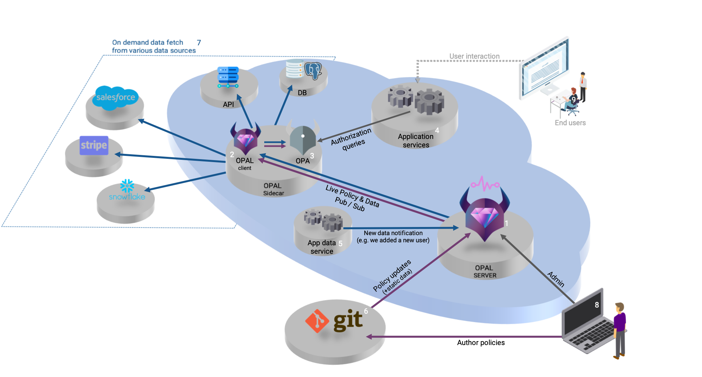

# Authorization using OPAL, OPA, Cedar

**Authorization** is the process of determining if a specific user request to do something is allowed by the defined set of policies. Authorization works by evaluating each incoming request against the set of policies provided to Cedar (a specific language for authorization).

Authorization is preceded by **authentication**. Authentication is the process of verifying the principal’s identity, meaning that they are really who they claim to be. Authentication can involve user names, passwords, multi-factor authentication (MFA) devices, or other means of proving identity.

An authorization request is a request by an application for an authorization decision, asking the question “Can this principal take this action on this resource in this context?”. To reach the decision, Cedar’s authorization engine evaluates a request against each policy, and combines the results. It ultimately produces an authorization response that consists of the decision (Allow or Deny), and the list of determining policies that are the reasons for that decision.

In this example, we focus on controlling access to resources and ensuring that actions within systems adhere to predefined policies. It's about determining who is allowed to do what, and under what conditions.

Tow of the key players in this field is Open Policy Agent (OPA) and Cedar (created in 2023), general-purpose policy engines. They're designed to unify policy enforcement across a wide range of applications and technologies. They allow us to define our policies in a high-level, declarative language, decoupling the policy decision-making process from its enforcement. This means we can write policies once and enforce them anywhere in our system, ensuring consistency and ease of management.

## Architecture

- Authorization
  - OPAL Server
    - **Pub/Sub Channel Management**: Like a broadcasting station, the OPAL Server manages a channel for clients to 'tune in' and receive updates.
    - **Git Repository Monitoring**: Watches a git repository for changes in policies or static data, using either active checking (polling) or alerts (webhook).
    - **Data Update Reception**: Receives notifications (via REST API) about new data that needs to be shared.
    - **Sending Updates to Clients**: Packages and sends these updates to all listening clients.
    - **Scalability through Backbone Pub/Sub**: Connects with other servers using platforms like Postgres, Redis, or Kafka for efficient handling of more clients and data.
  - OPAL Client
    - **Installation with Policy Agent**: Installed alongside a policy enforcer, keeping it updated with the latest rules.
    - **Subscription to Updates**: Constantly tuned into the OPAL Server's channel for relevant data and policy updates.
    - **Configuration Retrieval**: Gathers necessary settings and configurations from the server.
    - **Data Acquisition**: Fetches data from various sources like databases, APIs, or external services.
    - **Policy Updates Download**: Regularly updates its rulebook (policies) from the server to stay current.
  - Cedar (you could also use OPA)
    - A policy engine used for unified policy enforcement across different platforms.
- React app
  - A web application built with React.js for managing and visualizing policies and data.

_Images from [docs.opal.ac](https://docs.opal.ac/overview/architecture)_

## Test the servers

### Test OPAL Client server

We gonna check [Cedar endpoints](https://github.com/permitio/cedar-agent#api-endpoints):

1. Open one terminal --> Go to directory `cd authorization` --> Run Broadcast, OPAL Server and OPAL Client on Docker.
2. Open OPAL Client server (the Cedar Agent) on the browser `http://localhost:8180/rapidoc/index.html`.

### Test app's backend server

1.

## Resources

- Explanation and tutorials for OPAL, OPA and Cedar at https://docs.opal.ac/
- Architecture and flows (users and admins) https://docs.opal.ac/overview/architecture
- Cedar https://www.cedarpolicy.com/
- List of API endpoints for your localhost Cedar Client localhost API https://github.com/permitio/cedar-agent#api-endpoints
- Cedar Agent https://github.com/permitio/cedar-agent
- Cedar playground https://www.cedarpolicy.com/en/playground
- Tutorial for OPAL and Cedar https://github.com/permitio/opal-cedar
